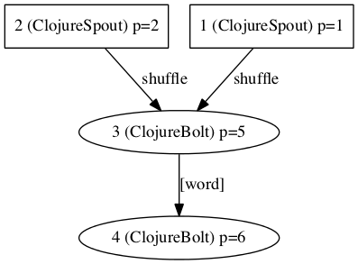
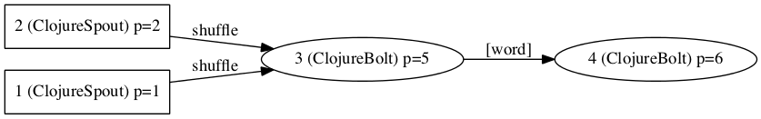

# storm-spirit

A Clojure library designed to help you better understand your <a href="https://github.com/apache/incubator-storm">Storm</a> topology visualizing it.
At this moment the only one visualization way is supported - <a href="http://www.graphviz.org/">graphviz</a>.

## Usage

Use of this project requires that [Graphviz](http://www.graphviz.org) is installed, which can be checked by running `dot -V` at the command line.  If it's not installed, you can do the following:

| platform | directions |
|----------|------------|
| Linux | install `graphviz` using your package manager |
| OS X | [download the installer](http://www.graphviz.org/Download_macos.php) |
| Windows |  [download the installer](http://www.graphviz.org/Download_windows.php) |

Lets assume that var `topology` holds your topology built something [like that](https://github.com/hsestupin/storm-spirit/blob/master/test/storm_spirit/topology_example.clj#L45"). You can build the view of topology like this:

``` clojure
; using wrapper
(storm-spirit.core/visualize-with-graphviz topology)
; or multimethod call
(storm-spirit.core/visualize {:view-format :graphviz :topology t})
```

And you will see:



Also by default it draws vertical graph but you could specify the direction like this (see possible parameter values http://www.graphviz.org/content/attrs#drankdir):

``` clojure
; using wrapper
(storm-spirit.core/visualize-with-graphviz topology {:graph-attrs {:rankdir :RL}})
; or multimethod call
(storm-spirit.core/visualize {:view-format :graphviz :topology topology
            :graph-attrs {:rankdir :RL}})
```
Which produces the following image:


Please notice that any [graph attributes](http://www.graphviz.org/content/attrs) specified in the map `:graph-attrs` are simply passed to dot.

## License

Copyright (C) 2014 Sergey Stupin

Distributed under the Eclipse Public License, the same as Clojure.